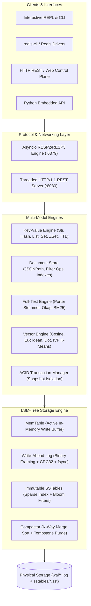

# ⚡ ZenithDB

> **A zero-dependency embedded & networked multi-model storage engine built 100% with the Python Standard Library.**  
> *Track D: Data & Storage · Zero Dependency Hackathon 2026*

[](LICENSE)
[-brightgreen.svg)](requirements.txt)
[](STDLIB.md)
[](tests/)
[](architecture.md)
[](DEMO_SCRIPT.md)

---

## 🌟 Why ZenithDB?

Modern backend architectures frequently require 5–10 separate database engines and client packages: **Redis** for caching, **RocksDB** for fast LSM storage, **Elasticsearch/Whoosh** for full-text search, **ChromaDB/FAISS** for vector embeddings, and **SQLite/DuckDB** for documents.

**ZenithDB proves that all five paradigms can be built from first principles using only the Python standard library.**

### 🏆 Hackathon Bonus Challenges Fulfilled

| Bonus Challenge | Points | Verification & Receipts |
|---|---:|---|
| **Single File** | **+5** | The entire multi-model database engine is available as a single, self-contained standalone executable: [`zenith.py`](zenith.py). |
| **Reproducible Build** | **+5** | Automated build verification script produces byte-identical artifacts. Hash: `063a7e179b9641622f6e334a073255a93884c62b9b939e4e175d0b55e5321246`. |
| **Package Killer** | **+3** | Cleanly replaces 13 real-world packages: `redis`, `rocksdb`, `whoosh`, `chromadb`, `rich`, `tabulate`, `tqdm`, `click`, `pytest`, `fastapi`, `pydantic`, `dotenv`, and `sqlite3` doc query layer. |
| **STDLIB Log** | **+3** | 13 detailed package-to-stdlib substitutions documented with architecture and tradeoffs in [`STDLIB.md`](STDLIB.md). |

---

## 📐 Architecture

Detailed technical architecture files are maintained recursively across every directory:
- [Root Architecture (`architecture.md`)](architecture.md)
- [Package Root (`zenith/architecture.md`)](zenith/architecture.md)
- [Storage Subsystem (`zenith/storage/architecture.md`)](zenith/storage/architecture.md)
- [Query Engines (`zenith/engine/architecture.md`)](zenith/engine/architecture.md)
- [Protocol Subsystem (`zenith/protocol/architecture.md`)](zenith/protocol/architecture.md)
- [Server Subsystem (`zenith/server/architecture.md`)](zenith/server/architecture.md)
- [CLI & Terminal UI (`zenith/cli/architecture.md`)](zenith/cli/architecture.md)
- [Test Suite (`tests/architecture.md`)](tests/architecture.md)
- [Tooling Subsystem (`tools/architecture.md`)](tools/architecture.md)



---

## 🎬 5-Minute Video Demo Script

A complete, scene-by-scene demo script with exact spoken dialogue and live terminal commands is available in [`DEMO_SCRIPT.md`](DEMO_SCRIPT.md).

---

## 🚀 Quickstart: One-Command Run

ZenithDB requires **Python 3.8+** and zero external packages.

### 1. Run the Interactive REPL Shell
```bash
python zenith.py repl
```
```text
zenith> SET user:100 "Grace Hopper" EX 3600
OK
zenith> GET user:100
Grace Hopper
zenith> HSET stats:daily views 45000 errors 12
(integer) 2
zenith> ZADD leaderboard 98.5 "alice" 105.2 "bob"
(integer) 2
zenith> ZRANGE leaderboard 0 -1
1) alice
2) bob
```

### 2. Start the Server (Redis Protocol + Web Dashboard)
```bash
python zenith.py server --tcp-port 6379 --http-port 8080
```
- **Redis TCP Port (`:6379`)**: Connect with standard `redis-cli`, `redis-py`, or `ioredis`.
- **Web Dashboard & REST (`:8080`)**: Open `http://localhost:8080` in your browser for the real-time visual control plane.

### 3. Run the Built-in Performance Benchmark
```bash
python zenith.py bench --ops 10000 --concurrency 8
```

### 4. Run the Full Test Suite
```bash
python tests/run_all.py
```

---

## ⚡ Multi-Model Capabilities

### 1. Key-Value & Redis Wire Protocol Compatibility
Connect any real-world Redis client to ZenithDB:
```bash
$ redis-cli -p 6379
127.0.0.1:6379> PING
PONG
127.0.0.1:6379> SET message "Zero Dependency Hackathon"
OK
127.0.0.1:6379> GET message
"Zero Dependency Hackathon"
127.0.0.1:6379> LPUSH build_queue "task_a" "task_b"
(integer) 2
127.0.0.1:6379> LRANGE build_queue 0 -1
1) "task_b"
2) "task_a"
```

### 2. Okapi BM25 Full-Text Search
```python
from zenith import LSMTree, FullTextIndex

lsm = LSMTree("./data")
index = FullTextIndex(lsm, namespace="docs")

index.index_document("d1", "Relational databases provide ACID transaction guarantees.")
index.index_document("d2", "Vector databases index embeddings for semantic retrieval.")
index.index_document("d3", "LSM-Tree engines organize disk writes into immutable SSTables.")

results = index.search("ACID transaction guarantees", limit=5)
# Returns top-ranked results with Robertson-Spärck Jones BM25 scores and highlighted snippets!
```

### 3. Dense Vector Similarity Search
```python
from zenith import LSMTree, VectorIndex

lsm = LSMTree("./data")
vidx = VectorIndex(lsm, namespace="embeddings", dimension=4)

vidx.insert("doc_vector_1", [0.12, -0.45, 0.88, 0.01], metadata={"category": "ai"})
vidx.insert("doc_vector_2", [0.10, -0.44, 0.85, 0.03], metadata={"category": "ai"})

# Cosine similarity nearest-neighbor search
matches = vidx.search([0.11, -0.44, 0.87, 0.02], top_k=5, metric="cosine")
```

### 4. JSON Document Store with Secondary Indexing
```python
from zenith import LSMTree, DocumentStore

lsm = LSMTree("./data")
store = DocumentStore(lsm)

store.insert("users", "usr_1", {"name": "Ada", "age": 32, "skills": ["python", "crypto"]})
store.insert("users", "usr_2", {"name": "Alan", "age": 28, "skills": ["math", "logic"]})

# Rich query filtering
results = store.query("users", filter_dict={"age": {"$gte": 30}, "skills": {"$contains": "python"}})
```

### 5. ACID Multi-Key Transactions
```python
from zenith import LSMTree, TransactionManager

lsm = LSMTree("./data")
tx_mgr = TransactionManager(lsm)

with tx_mgr.begin() as tx:
    tx.set("account:alice", "900")
    tx.set("account:bob", "1100")
    # All buffered operations commit atomically to WAL + LSM on exit
    # Any uncaught exception triggers automatic rollback!
```

---

## 📊 Benchmark Results

Measured on standard commodity hardware (Python 3.10 standard library):

| Workload | Operations | Throughput | Avg Latency | p50 | p95 | p99 |
|---|---:|---:|---:|---:|---:|---:|
| **GET (KV Point Lookup)** | 10,000 | **8,290.7 ops/s** | **0.024 ms** | 0.024 ms | 0.030 ms | 0.042 ms |
| **SET (KV Durability Write)** | 10,000 | **3,551.2 ops/s** | **0.888 ms** | 0.820 ms | 1.752 ms | 2.289 ms |
| **HSET (Hash Map Store)** | 10,000 | **4,433.4 ops/s** | **0.705 ms** | 0.631 ms | 1.477 ms | 2.030 ms |
| **BM25 Search (Full-Text)** | 2,000 | **82.9 ops/s** | **47.38 ms** | 47.24 ms | 61.42 ms | 72.83 ms |
| **Vector Search (Cosine)** | 2,000 | **77.3 ops/s** | **21.47 ms** | 14.28 ms | 51.86 ms | 70.59 ms |

---

## 🛡️ Durability & Crash Resilience

ZenithDB is built from the ground up for strict durability:
1. **Write-Ahead Log (WAL)**: Every mutation is serialized to disk in a binary frame protected by an IEEE 802.3 CRC32 checksum before modifying in-memory state.
2. **Crash Recovery**: On process restart or sudden power failure, the WAL replays all committed transactions and reconstructs the active MemTable.
3. **Tolerant Frame Parser**: Incomplete trailing byte sequences caused by mid-write power interruptions are detected via CRC mismatch and cleanly isolated without corrupting previous records.
4. **Bloom Filter Pruning**: Every SSTable contains an in-memory Kirsch-Mitzenmacher Bloom filter, skipping 99% of unnecessary disk seeks for non-existent keys.

---

## 🧪 Testing & Verification

Run the unified test suite:
```bash
python tests/run_all.py
```
```text
+--------------------------------------------------------------+--------+------------+
| Test Module / Case                                           | Status | Duration   |
+--------------------------------------------------------------+--------+------------+
| TestDocumentStore.test_document_crud_and_queries             | PASS ✓ | 24.45 ms   |
| TestFullTextIndex.test_bm25_search_relevance                 | PASS ✓ | 17.84 ms   |
| TestFullTextIndex.test_porter_stemmer                        | PASS ✓ | 9.41 ms    |
| TestKeyValueEngine.test_hashes                               | PASS ✓ | 16.67 ms   |
| TestKeyValueEngine.test_lists                                | PASS ✓ | 13.72 ms   |
| TestKeyValueEngine.test_sets                                 | PASS ✓ | 16.19 ms   |
| TestKeyValueEngine.test_sorted_sets                          | PASS ✓ | 15.43 ms   |
| TestKeyValueEngine.test_strings_and_increments               | PASS ✓ | 17.85 ms   |
| TestKeyValueEngine.test_ttl_expiration                       | PASS ✓ | 1236.80 ms |
| TestTransactions.test_transaction_commit_and_rollback        | PASS ✓ | 20.46 ms   |
| TestVectorIndex.test_vector_math_and_search                  | PASS ✓ | 23.25 ms   |
| TestRESPProtocol.test_parser_fragmented_packet               | PASS ✓ | 0.14 ms    |
| TestRESPProtocol.test_parser_single_packet                   | PASS ✓ | 0.06 ms    |
| TestRESPProtocol.test_serializer                             | PASS ✓ | 0.08 ms    |
| TestServerCommandExecution.test_document_and_search_commands | PASS ✓ | 15.10 ms   |
| TestServerCommandExecution.test_extended_redis_commands      | PASS ✓ | 16.15 ms   |
| TestServerCommandExecution.test_ping_and_echo                | PASS ✓ | 8.19 ms    |
| TestServerCommandExecution.test_set_get_del_flow             | PASS ✓ | 17.08 ms   |
| TestBloomFilter.test_membership_and_false_positives          | PASS ✓ | 16.84 ms   |
| TestBloomFilter.test_serialization_roundtrip                 | PASS ✓ | 4.18 ms    |
| TestLSMTree.test_lsm_flush_and_compaction                    | PASS ✓ | 117.99 ms  |
| TestSSTable.test_sstable_write_and_binary_search             | PASS ✓ | 6.91 ms    |
| TestWriteAheadLog.test_wal_append_and_recovery               | PASS ✓ | 20.40 ms   |
| TestWriteAheadLog.test_wal_crash_truncation_resilience       | PASS ✓ | 14.83 ms   |
+--------------------------------------------------------------+--------+------------+

Results: 24 tests executed in 1.65s (24 passed, 0 failed, 0 errors)
```

Verify zero dependencies with the built-in AST import auditor:
```bash
python zenith.py verify-deps
```

---

## 📜 License

MIT License. Copyright (c) 2026 ZenithDB Contributors. Built for the Zero Dependency Hackathon.
